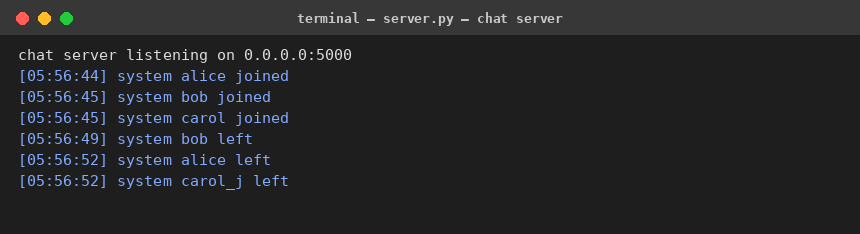
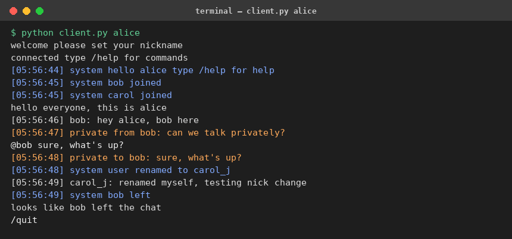
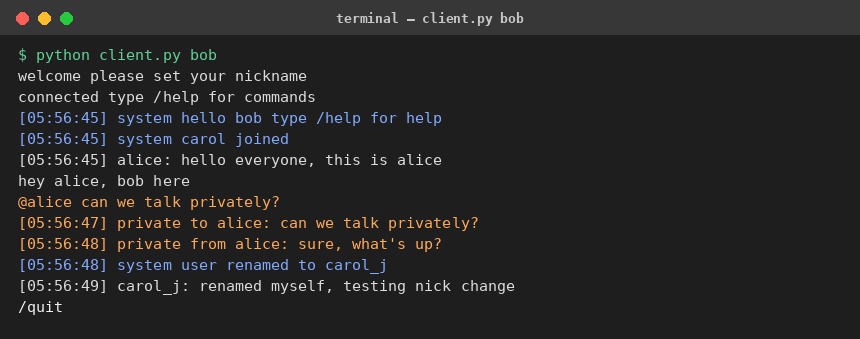
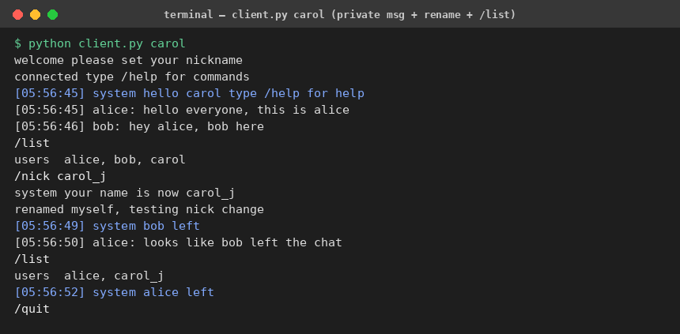

# 💬 Real-Time Chat App with Socket Programming (Python)

A real-time, multi-client console chat application built from scratch using
raw **TCP sockets**, **multithreading**, and a simple line-based text protocol —
no frameworks, no external libraries. Built as a portfolio / proof-of-work
project to demonstrate core networking and concurrency concepts.



---

## 📌 Project Overview

This project implements a central chat **server** that many **clients** can
connect to simultaneously over TCP. Every client runs on its own thread on
the server, messages are broadcast in real time to all connected users, and
the protocol also supports private messaging, nickname changes, and a small
set of slash-commands.

**Problem it solves:** demonstrates how real-time communication systems
(chat apps, live support tools, multiplayer game lobbies, collaboration
tools, notification systems) are built at the socket level — the foundation
underneath higher-level frameworks like WebSockets, gRPC streaming, or
message brokers.

---

## 🏭 Industry Relevance

The concepts in this project map directly onto real systems:

| Concept used here | Where it shows up in industry |
|---|---|
| TCP sockets, connection handling | Messaging systems (Slack, WhatsApp backend), live chat/support widgets |
| Thread-per-connection concurrency | Multiplayer game servers, real-time collaboration tools (Google Docs-style) |
| Message broadcasting | Notification systems, pub/sub style fan-out |
| Shared-state locking | Any concurrent server managing shared session/user state |
| Graceful disconnect & cleanup | Production reliability — no "ghost" connections or crashes |

Sockets and concurrency remain relevant even in an AI-driven landscape:
AI products still need reliable backend servers, APIs, real-time channels,
and databases to actually ship — model quality alone doesn't replace solid
systems engineering.

---

## 🧠 Core Concepts Demonstrated

- **`socket`** — low-level TCP client/server communication
- **`threading`** — thread-per-client model + a dedicated writer thread per
  client (decouples reading from writing so one slow client can't block
  another)
- **`queue.Queue`** — thread-safe outgoing message buffering
- **Locks (`threading.Lock`)** — protects shared dictionaries (`clients_by_sock`,
  `clients_by_name`) from race conditions
- **`socket.makefile()`** — reliable line-buffered reads over a raw socket
  (avoids partial/merged-message bugs — see [Design Notes](docs/architecture.md))
- **Exception handling** — graceful handling of resets, timeouts, and abrupt
  client disconnects so the server never crashes
- **Simple text protocol design** — `NICK`, `@name message`, `/list`,
  `/nick`, `/quit`, `/help`

---

## 🏗️ Architecture

```
 Client 1 ─┐
 Client 2 ─┼──► TCP Socket Connection ──► Server (accept loop)
 Client 3 ─┘                                   │
                                    spawns one thread per client
                                                │
                                     ┌──────────┴───────────┐
                                     │   Client Handler      │
                                     │   Thread (reader)     │
                                     └──────────┬────────────┘
                                                │  parses line
                                    ┌───────────┼────────────┐
                                    │           │            │
                              broadcast()  send_private() handle_command()
                                    │           │            │
                                    └─────► per-client outgoing Queue ◄────┘
                                                │
                                     Writer Thread flushes queue
                                                │
                                         back to that Client's socket
```

Full design notes (protocol spec, threading model, and the handshake race
condition that was found and fixed during testing) are in
[`docs/architecture.md`](docs/architecture.md).

---

## 📂 Folder Structure

```
Python-Chat-App-Socket-Programming/
│
├── src/
│   ├── server/
│   │   └── server.py        # ChatServer — accepts clients, broadcasts, routes
│   └── client/
│       └── client.py        # ChatClient — console client
│
├── simulate.py               # scripted 3-client simulation (used to generate proof/screenshots)
├── render_screenshots.py     # renders logs/ transcripts into terminal-style PNGs
│
├── logs/                     # captured session transcripts (proof of a real run)
│   ├── server_console.log
│   ├── alice_terminal.txt
│   ├── bob_terminal.txt
│   └── carol_terminal.txt
│
├── screenshots/               # PNG screenshots for README / GitHub proof
│   ├── 01_server_running.png
│   ├── 02_client_alice.png
│   ├── 03_client_bob.png
│   └── 04_client_carol.png
│
├── docs/
│   ├── architecture.md        # protocol spec + design notes
│   ├── testing.md             # manual test matrix
│   └── interview_prep.md      # Q&A prep for this project
│
├── README.md
└── .gitignore
```

---

## ✨ Features

**Mandatory**
- ✅ Start a chat server, accept multiple simultaneous clients
- ✅ Enter/register a username (`NICK`)
- ✅ Send & receive messages in real time
- ✅ Broadcast messages to all connected users
- ✅ Join / leave notifications
- ✅ Graceful disconnect (no crash on abrupt client exit)
- ✅ Robust exception handling

**Recommended (also implemented)**
- ✅ Private messaging — `@username your message`
- ✅ Active user list — `/list`
- ✅ Nickname change — `/nick newname`
- ✅ Timestamps on every broadcast/system message

**Optional / future improvements**
- ⬜ Swing/JavaFX or Tkinter GUI
- ⬜ Multiple chat rooms
- ⬜ File sharing
- ⬜ Login/registration + database-backed accounts
- ⬜ Persistent chat history logging to disk
- ⬜ TLS encryption

---

## ▶️ How to Run

Requires **Python 3.9+**, no external installs.

### 1. Start the server
```bash
cd src/server
python3 server.py
```
You should see:
```
chat server listening on 0.0.0.0:5000
```

### 2. Start clients (in separate terminals)
```bash
cd src/client
python3 client.py alice
python3 client.py bob
python3 client.py carol
```

### 3. Try it out
| Action | How |
|---|---|
| Send a public message | just type and press Enter |
| Send a private message | `@bob hey, got a sec?` |
| List connected users | `/list` |
| Change your nickname | `/nick newname` |
| See available commands | `/help` |
| Disconnect | `/quit` |

Default host: `127.0.0.1` · Default port: `5000`
If port `5000` is already in use, change `PORT` at the top of `server.py`
and `SERVER_PORT` in `client.py`, or pass a host/port as extra args to
`client.py <nick> <host> <port>`.

### 4. Run the full automated simulation (no manual typing needed)
This is how the screenshots in this repo were generated — it starts the
server, spins up 3 scripted clients (alice, bob, carol), runs a full
conversation including private messages, `/list`, and a nickname change,
then saves each client's transcript to `logs/`.
```bash
python3 src/server/server.py &
python3 simulate.py
python3 render_screenshots.py   # regenerates screenshots/*.png from logs/
```

---

## 🖼️ Proof of a Real Run

**Server accepting 3 clients, handling joins/leaves:**


**Client — Alice** (public chat, private reply, sees bob leave):



**Client — Bob** (public chat, sends a private message, then `/quit`):



**Client — Carol** (`/list`, `/nick` rename, sees updated user list):



More proof-of-run guidance: [`docs/screenshots_checklist.md`](docs/screenshots_checklist.md)

---

## 🧪 Testing

See [`docs/testing.md`](docs/testing.md) for the full manual test matrix
(duplicate usernames, empty messages, abrupt disconnects, invalid private
message targets, port conflicts, etc.) — all of which were exercised while
building this project.

---

## 🎯 Learning Outcomes

- How to design and implement a text-based network protocol
- Thread-per-connection server concurrency, and why a separate writer
  thread per client avoids one slow/blocked client affecting others
- Safe shared-state access with locks
- Debugging real network race conditions (see the handshake bug fix in
  [`docs/architecture.md`](docs/architecture.md))
- Structuring a project for GitHub as a portfolio piece

## 🚧 Limitations

- No encryption (plaintext TCP) — not suitable for production/public internet use as-is
- No persistent database — user state resets when the server restarts
- Single chat room only
- No authentication beyond nickname uniqueness

## 🔮 Future Improvements

- Add a GUI (Tkinter/PyQt) chat window
- Multiple chat rooms/channels
- TLS support (`ssl` module) for encrypted connections
- Persistent chat history (SQLite)
- File transfer support

---

## 🎤 Interview Prep

See [`docs/interview_prep.md`](docs/interview_prep.md) for 10 predicted
interview questions with model answers, including "Explain your project."

---

## 👤 Author

Built as a Java-course-inspired systems/networking portfolio project,
implemented in Python for portability and ease of review.
